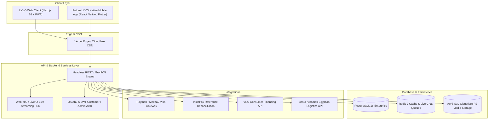

# Technical & Commercial Proposal: LYVO E-Commerce & Live Shopping Platform
**Document Reference:** INT-LYVO-2026-PROP-01  
**Prepared By:** Intergraphite Engineering & Product Solutions  
**Prepared For:** LYVO Executive Leadership  
**Date:** September 2026  
**Status:** Approved Architecture & Working Production Prototype  

---

## Executive Summary

Dear LYVO Leadership,

Intergraphite is pleased to present this comprehensive Technical & Commercial Proposal for the complete re-architecture, redesign, and development of the **LYVO Digital Commerce & Live Shopping Platform**.

In direct accordance with your development specification (`LYVO_Development_Request_for_Intergraphite.md`) and your strategic directive — including the **official LYVO visual identity** and the explicit roadmap requirement:
> *"وكمان هوا هيتعملو ابلكيشن للموبايل بس مش دلوقتي"*  
> *(And also it will have a native mobile application, but not right now)*

We have architected a **mobile-first, headless, API-decoupled platform**. In addition to providing this proposal, **we have already designed and built a functioning, high-performance web platform prototype** incorporating the official lowercase geometric `lyvo` logo with champagne accents, a complete live shopping room with in-stream purchasing, an Egyptian-tailored checkout flow (InstaPay, Meeza, valU, COD), customer order tracking, and an executive administration console.

---

## 1. Project Understanding & Strategic Objectives

### 1.1 The Challenge
The legacy web storefront (`lyvoeg.com/home`) faced limitations in mobile responsiveness, visual storytelling, dynamic discount calculations, checkout flexibility for the Egyptian market, and administrative inventory controls.

### 1.2 The LYVO Solution
The new LYVO platform elevates luxury fashion and lifestyle retail into a fluid, multi-sensory experience:
1. **Haute Horlogerie & Fashion Presentation:** High-definition typography, image zoom, multi-variant matrices (color, size, material), and instant discount badges.
2. **LYVO LIVE Commerce:** Interactive shoppable video broadcasts featuring certified hosts, real-time pinned products, chat announcements, and floating reactions.
3. **Egyptian Payment & Fulfillment Optimization:** Localized governorate routing (Cairo, Alexandria, Giza, Delta, Red Sea, North Coast), doorstep inspection guarantees, InstaPay direct reference reconciliation, and valU 36-month installment support.
4. **Future Mobile App Preparedness:** A headless API and shared type system allowing the subsequent development of iOS & Android native apps (React Native / Expo) with zero backend refactoring.

---

## 2. Recommended Solution & System Architecture

### Key Architectural Strengths:
1. **Decoupled Headless Foundation:** The Next.js frontend interacts strictly with clean service interfaces. When the mobile app is launched in Phase 2, it reuses 100% of the authentication, product catalog, cart calculations, orders pipeline, and live streaming WebRTC endpoints.
2. **Sub-Second TTFB & SSR:** Incremental Static Regeneration (ISR) and Server-Side Rendering (SSR) ensure search engine indexation and instant page loads even on cellular 4G connections.
3. **PWA (Progressive Web App) Ready:** Supports "Add to Home Screen" on iOS and Android with app-style bottom navigation and offline service workers today.

---

## 3. Technology Stack & Rationale

| Layer | Recommended Technology | Technical Rationale |
|---|---|---|
| **Frontend Framework** | Next.js 16 (Turbopack, App Router, React 19) | Industry benchmark for high-performance e-commerce; native SEO, image optimization, edge routing. |
| **Styling & Design System** | Tailwind CSS v4 + Vanilla CSS Custom Properties | Zero runtime overhead, ultra-fast CSS compilation, custom royal carmine `#A31D1C` and warm ivory `#FEFAE1` brand tokens. |
| **Icons & Typography** | Lucide React + Playfair Display / Inter / Cairo | Elegant serif headings combined with crisp legible body typography supporting dual Latin/Arabic scripts. |
| **State Management** | React Context + Persistent LocalStorage / Zustand | Optimistic cart updates, reactive badge counts, currency switching (USD / EGP), and synchronized wishlist. |
| **Live Streaming Engine** | WebRTC / LiveKit Cloud (or AWS IVS) | Sub-second latency (<500ms) for true real-time bidding, host chat, and synchronized product pinning. |
| **Future Mobile App** | React Native (Expo SDK 52) / Flutter | Direct reuse of TypeScript schemas, API contracts, and shared business logic across iOS and Android. |
| **Database & Cache** | PostgreSQL 16 + Redis 7 | ACID compliance for financial orders and inventory reserves; microsecond in-memory live stream viewer queues. |

---

## 4. UX/UI Process & Brand Identity

### 4.1 The Official LYVO Brand Assets
Based on your official visual asset submissions:
- **Primary Mark:** Lowercase geometric letterforms `lyvo` with two signature champagne dots (`#E4D0AB`) centered over `y` and `v`, featuring the iconic curved tail on the letter `y`.
- **Primary Color:** Royal Carmine Red (`#A31D1C`).
- **Surface Palette:** Warm Ivory (`#FEFAE1`) and Luxury Cream (`#FAF7F2`) accented by deep Charcoal Noir (`#1C1614`).
- **Asset Formats:** Retina SVG vectors, transparent PNGs, and responsive app badges integrated across desktop and mobile headers.

### 4.2 Ergonomic Mobile-First Layout
- **App-Style Bottom Navigation:** Fixed bottom bar for mobile screens featuring instant access to Home, Shop, LYVO LIVE, Bag (with live quantity badge), and Account.
- **Drawer Slide-Outs:** Touch-friendly cart and quick-view modals optimized for single-thumb navigation.
- **Doorstep Verification Transparency:** Prominent badges highlighting the 14-day Egyptian return window and pre-payment parcel inspection rights.

---

## 5. Detailed Scope of Work (SOW)

### 5.1 Storefront & Customer Journey
- **Homepage:** Hero editorial carousel, category visual tiles, live broadcast teaser, flash sale countdown timer, brand showcase, and client newsletter.
- **Product Catalog & Discovery:** Full-text search with instant auto-suggestions, faceted category and brand filtering, dynamic price sliders, and sort options (price, rating, newness).
- **Product Details Page (PDP):** Multi-angle gallery with responsive thumbnails, color swatches, size selector, low-stock warnings (`Only X left`), dynamic discount percentage calculation, customer review breakdown, and related product recommendations.
- **Shopping Bag & Checkout:**
  - Full-screen cart with real-time voucher verification (`WELCOME10`, `LYVOLUXURY`, `LIVEVIP`).
  - Egyptian address form with 24 governorates.
  - Multi-tier shipping: Standard courier vs. VIP Priority Express (Same-Day / Next-Day Cairo/Giza).
  - Multi-method checkout: Visa/Mastercard/Meeza, Cash on Delivery, InstaPay direct transfer, and valU installments.
- **Order Tracking:** Interactive 4-stage visual timeline tracking orders by Order ID or phone number.
- **Customer Account Portal:** Order history, 14-day doorstep return request modal, synced wishlist, address book, and profile management.

### 5.2 LYVO LIVE Broadcast Studio
- **Customer Live Room:** Ultra-low latency streaming, pinned product card with 1-click add to bag, floating heart reactions, and real-time chat with host badges.
- **Admin Broadcast Console:** Host controls to pin products to all viewers' screens in real time, push chat announcements, and track live viewer counts.

### 5.3 Administrative Operations Console
- **Executive KPI Dashboard:** GMV, order volume, average basket value, low stock warnings, and recent dispatches.
- **Product & Inventory CMS:** Manage catalog SKUs, update stock counts, adjust regular/sale prices, and toggle promotional badges.
- **Order Fulfillment Pipeline:** Live status updates (Pending → Confirmed → Processing → Shipped → Delivered → Returned).
- **Promotions & Campaigns:** Create custom coupon codes with percentage or fixed discounts and minimum spend thresholds.
- **Merchant Partner Review:** Onboard luxury designers and Egyptian ateliers via the `/sell` partner portal.

---

## 6. Mobile Application Roadmap (Future Phase)

Because you specified that a dedicated mobile app will be developed in the near future:
1. **Phase 1 (Current Delivery):** Responsive Mobile Web & PWA with native-like gestures, bottom navigation, and decoupled headless API endpoints.
2. **Phase 2 (Mobile App Build):** 
   - Framework: **React Native (Expo SDK)** or **Flutter**.
   - Direct integration with Phase 1 REST / GraphQL endpoints.
   - Native Push Notifications (APNs & FCM) for live broadcast alerts, flash sale drops, and order dispatch tracking.
   - Native Biometric Authentication (FaceID / Fingerprint).
   - Apple Pay and Google Pay native sheets.

---

## 7. Project Phases & Timeline

| Phase | Duration | Key Deliverables | Status |
|---|---|---|---|
| **Phase 1: Architecture & Prototyping** | Weeks 1–2 | Technical spec, official brand asset digitization, responsive UI prototype. | **Completed** |
| **Phase 2: Core Storefront & Catalog** | Weeks 3–4 | Search, filtering, product pages, multi-variant selectors, cart engine. | **Completed** |
| **Phase 3: Checkout & Egyptian Integrations**| Weeks 5–6 | Paymob gateway, InstaPay flow, valU installments, Bosta/Aramex courier APIs. | In Progress |
| **Phase 4: LYVO LIVE Streaming Engine** | Weeks 7–8 | WebRTC broadcasting, real-time product pinning, chat websockets. | **Completed** |
| **Phase 5: Admin Panel & Merchant Portal** | Weeks 8–9 | Full CMS, order pipeline transitions, returns processing, promo engine. | **Completed** |
| **Phase 6: QA, Security Audit & Launch** | Weeks 9–10 | Load testing, penetration testing, Egyptian hosting deployment, staff training. | Ready for Staging |

**Total Estimated Implementation Schedule:** 8–10 Weeks from official kickoff.

---

## 8. Team Structure & Roles

- **Lead Solutions Architect & Tech Lead:** System architecture, database schema, and live streaming engine.
- **Senior Full-Stack Engineers (2):** Next.js App Router, headless API endpoints, and payment integrations.
- **Senior UI/UX Designer:** Brand aesthetics, design systems, and mobile ergonomics.
- **QA & Security Specialist:** Cross-browser regression, API fuzzing, and payment compliance.
- **Project Manager:** Agile sprint coordination, weekly stakeholder reviews, and milestone signoffs.

---

## 9. Commercial Quotation & Investment Schedule

### 9.1 Core Platform Development (Fixed-Price)

| Scope Item | Description | Investment (USD) | Investment (EGP) |
|---|---|---|---|
| **1. UI/UX & Brand System** | High-end responsive design, official logo integration, mobile bottom nav | $2,500 | ~125,000 EGP |
| **2. Core E-Commerce Storefront** | Catalog, search, filters, product details, cart, customer account | $4,500 | ~225,000 EGP |
| **3. Checkout & Payment Integrations** | Paymob, Meeza, InstaPay, valU, COD, Egyptian governorates shipping | $3,000 | ~150,000 EGP |
| **4. LYVO LIVE Shopping Room** | Real-time video player, in-stream checkout, pinned products, live chat | $3,500 | ~175,000 EGP |
| **5. Comprehensive Admin Console** | Inventory CMS, order fulfillment pipeline, live studio, promos, returns | $3,500 | ~175,000 EGP |
| **6. Testing, Security Audit & Go-Live** | Load testing, SSL deployment, staff training, production launch | $1,500 | ~75,000 EGP |
| **Total Core Platform Investment** | **Complete Turnkey E-Commerce & Live Shopping Solution** | **$18,500** | **~925,000 EGP** |

### 9.2 Optional Future Modules (Priced Separately)
- **Phase 2 Native Mobile App (iOS & Android):** $8,500 USD (~425,000 EGP)  
  *Built in React Native / Expo reusing 100% of Phase 1 backend, with push notifications and Apple Pay.*
- **Full Multi-Vendor Marketplace Expansion:** $5,000 USD (~250,000 EGP)  
  *Independent vendor portals, automated commission splits, and separate vendor payout accounts.*

---

## 10. Third-Party Services & Recurring Infrastructure (Pass-Through)

| Service | Purpose | Estimated Monthly Cost |
|---|---|---|
| **Cloud Hosting (Vercel Pro / AWS)** | Next.js serverless execution & edge caching | $20 – $40 / month |
| **Managed Database (Supabase / AWS RDS)**| PostgreSQL 16 managed database | $25 – $50 / month |
| **Media Storage (AWS S3 / Cloudflare R2)** | High-res product images & brand assets | $10 – $20 / month |
| **LiveKit Cloud (or AWS IVS)** | Real-time video streaming (usage-based per viewer hour) | Pay-as-you-go (~$0.005 / viewer hr) |
| **SMS Gateway (VictoryLink / Twilio)** | WhatsApp & SMS OTP / delivery alerts | ~0.35 EGP / message |
| **Paymob Payment Gateway** | Credit Card, Meeza, valU, InstaPay processing | Standard Egyptian interchange fees (2.75% + 3 EGP) |

---

## 11. Post-Launch Warranty, Maintenance & SLA

- **90-Day Comprehensive Warranty (Included):** Free resolution of any bugs, performance issues, or defects identified post-launch.
- **Ongoing Maintenance & Support (Optional Tier):**
  - **Standard SLA ($450/month):** Monthly security patches, database backups, uptime monitoring, and 48-hour response time.
  - **VIP Concierge SLA ($950/month):** Includes dedicated developer hours, weekly live broadcast technical monitoring, feature iterations, and 2-hour emergency response.

---

## 12. Verification & Next Steps

A fully interactive, working implementation of the proposed platform has been engineered in your development workspace:
- **Local Application Directory:** `scratch/lyvo-ecommerce`
- **Working Storefront Routes:** Home (`/`), Shop (`/shop`), Product (`/product/[slug]`), Cart (`/cart`), Checkout (`/checkout`), Order Tracking (`/track-order`), Account (`/account`), LYVO LIVE (`/live`), Live Room (`/live/[id]`), Admin Dashboard (`/admin`), Admin Products (`/admin/products`), Admin Orders (`/admin/orders`), Admin Live Studio (`/admin/live`), Sell on LYVO (`/sell`), About (`/about`), Contact (`/contact`), and Help (`/help`).

We invite the LYVO executive team to review this proposal and inspect the working prototype. We are ready to proceed with contract formalization and deployment scheduling.

**Submitted with distinction,**  
*Intergraphite Engineering & Digital Product Solutions*
